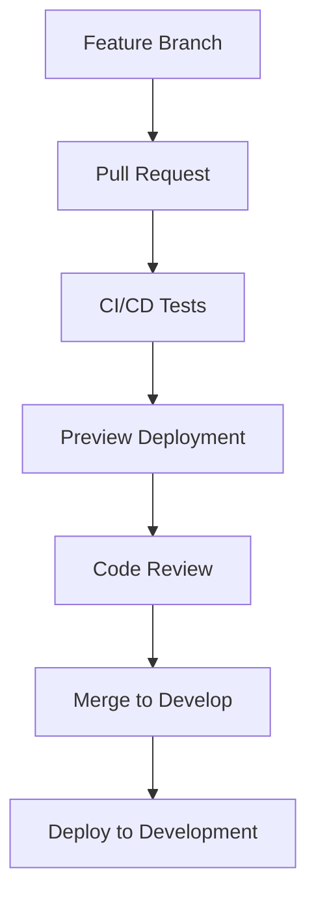
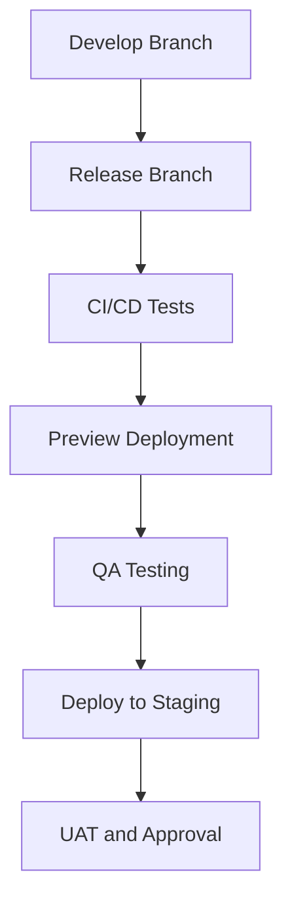
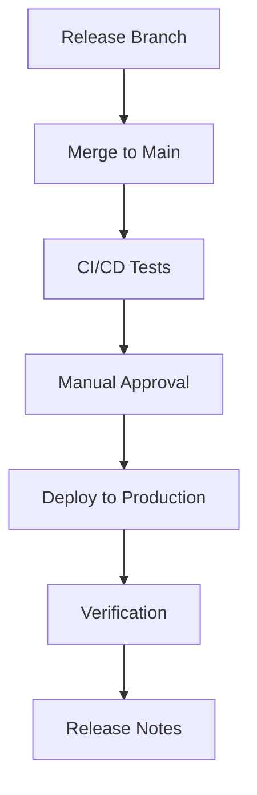

# Deployment Process

This document outlines the deployment process for the Afino fintech platform. It covers the different environments, deployment workflows, and best practices to ensure reliable and secure deployments.

## Deployment Environments

The Afino platform uses the following deployment environments:

### Development Environment

- **Purpose**: For development and testing of new features
- **URL**: https://dev.afino.com
- **Deployment Frequency**: Automatic on every merge to the `develop` branch
- **Data**: Test data, refreshed periodically
- **Access**: Internal team only

### Staging Environment

- **Purpose**: For QA, UAT, and pre-production testing
- **URL**: https://staging.afino.com
- **Deployment Frequency**: Automatic on every merge to a `release/*` branch
- **Data**: Anonymized production-like data
- **Access**: Internal team and selected stakeholders

### Production Environment

- **Purpose**: Live environment for end users
- **URL**: https://app.afino.com
- **Deployment Frequency**: Manual deployment after approval
- **Data**: Production data
- **Access**: End users and administrators

## Deployment Infrastructure

The Afino platform is deployed on Vercel with the following infrastructure:

### Vercel Platform

- **Edge Network**: Global CDN for static assets
- **Serverless Functions**: For API routes and server-side rendering
- **Preview Deployments**: For pull request previews
- **Analytics**: For monitoring and performance tracking

### Supabase Platform

- **PostgreSQL Database**: For application data
- **Authentication**: For user authentication
- **Storage**: For file storage
- **Edge Functions**: For database triggers and functions

## Deployment Workflow

### Development Deployment

1. Developer creates a feature branch from `develop`
2. Developer implements the feature and creates a pull request
3. CI/CD pipeline runs tests and creates a preview deployment
4. Code review and approval
5. Pull request is merged into `develop`
6. Automatic deployment to the development environment



### Staging Deployment

1. Release manager creates a release branch from `develop`
2. Final adjustments, version bumps, and documentation updates
3. CI/CD pipeline runs tests and creates a preview deployment
4. QA testing and approval
5. Automatic deployment to the staging environment
6. UAT and stakeholder approval



### Production Deployment

1. Release branch is merged into `main`
2. CI/CD pipeline runs tests
3. Manual approval for production deployment
4. Deployment to production environment
5. Post-deployment verification
6. Release notes and announcements



## Deployment Configuration

### Environment Variables

Environment variables are managed through Vercel's environment variable management:

- **Development**: Development-specific variables
- **Staging**: Staging-specific variables
- **Production**: Production-specific variables

Sensitive environment variables are encrypted and stored securely.

### Feature Flags

Feature flags are used to control the availability of features in different environments:

- **Development**: All features enabled
- **Staging**: New features enabled for testing
- **Production**: Features enabled after approval

Feature flags are managed through a configuration file and environment variables.

## Database Migrations

Database migrations are managed through Supabase migrations:

1. Create a new migration:
   ```bash
   supabase migration new <migration_name>
   ```

2. Edit the migration file in `supabase/migrations`

3. Apply the migration locally:
   ```bash
   supabase db push
   ```

4. Migrations are automatically applied during deployment:
   - Development: Automatically applied
   - Staging: Automatically applied
   - Production: Applied after approval

## Deployment Checklist

### Pre-Deployment Checklist

- [ ] All tests pass
- [ ] Code review completed
- [ ] Documentation updated
- [ ] Database migrations tested
- [ ] Performance impact assessed
- [ ] Security review completed
- [ ] Accessibility review completed
- [ ] Feature flags configured
- [ ] Rollback plan prepared

### Deployment Checklist

- [ ] Notify team of deployment
- [ ] Verify environment variables
- [ ] Deploy code changes
- [ ] Apply database migrations
- [ ] Verify deployment
- [ ] Run smoke tests
- [ ] Monitor for errors

### Post-Deployment Checklist

- [ ] Verify critical functionality
- [ ] Monitor performance metrics
- [ ] Monitor error rates
- [ ] Update documentation
- [ ] Notify stakeholders
- [ ] Update release notes
- [ ] Conduct post-deployment review

## Rollback Procedures

In case of deployment issues, the following rollback procedures are available:

### Code Rollback

1. Revert the merge commit
2. Create a new commit with the fix
3. Deploy the rollback

### Database Rollback

1. Create a new migration to revert the changes
2. Apply the rollback migration
3. Verify the database state

### Feature Flag Rollback

1. Disable the problematic feature flag
2. Deploy the configuration change
3. Verify the feature is disabled

## Monitoring and Alerting

### Deployment Monitoring

- **Vercel Dashboard**: Monitor deployment status and logs
- **Supabase Dashboard**: Monitor database status and logs
- **Error Tracking**: Monitor application errors with Sentry
- **Performance Monitoring**: Monitor application performance with Vercel Analytics

### Alerting

- **Deployment Alerts**: Notify team of deployment success or failure
- **Error Alerts**: Notify team of critical errors
- **Performance Alerts**: Notify team of performance degradation
- **Security Alerts**: Notify team of security issues

## Continuous Improvement

### Deployment Metrics

- **Deployment Frequency**: How often deployments occur
- **Lead Time**: Time from code commit to production deployment
- **Change Failure Rate**: Percentage of deployments that cause issues
- **Mean Time to Recovery**: Time to recover from deployment issues

### Post-Deployment Review

After each production deployment, conduct a post-deployment review:

1. What went well?
2. What could be improved?
3. Any unexpected issues?
4. How can we prevent similar issues in the future?

## Security Considerations

### Secure Deployment

- **Least Privilege**: Use the principle of least privilege for deployment access
- **Audit Logging**: Log all deployment actions
- **Secrets Management**: Securely manage secrets and credentials
- **Vulnerability Scanning**: Scan for vulnerabilities before deployment

### Compliance

- **Audit Trail**: Maintain an audit trail of all deployments
- **Change Management**: Document all changes
- **Approval Workflow**: Require approvals for production deployments
- **Separation of Duties**: Separate development and deployment responsibilities

## Disaster Recovery

### Backup and Restore

- **Database Backups**: Regular backups of the database
- **Point-in-Time Recovery**: Ability to restore to a specific point in time
- **Geo-Redundancy**: Backups stored in multiple geographic locations

### High Availability

- **Multi-Region Deployment**: Deploy to multiple regions for high availability
- **Automatic Failover**: Automatically failover to a healthy region
- **Load Balancing**: Distribute traffic across multiple instances

## Deployment Tools

### CI/CD Pipeline

- **GitHub Actions**: For continuous integration and deployment
- **Vercel Integration**: For automatic deployments
- **Supabase CLI**: For database migrations

### Deployment Scripts

- **Deployment Scripts**: Scripts for common deployment tasks
- **Rollback Scripts**: Scripts for rollback procedures
- **Verification Scripts**: Scripts for post-deployment verification

## Documentation

### Deployment Documentation

- **Deployment Guide**: Step-by-step guide for deployments
- **Rollback Guide**: Step-by-step guide for rollbacks
- **Troubleshooting Guide**: Guide for common deployment issues

### Release Notes

- **Release Notes Template**: Template for release notes
- **Changelog**: Record of all changes
- **Known Issues**: List of known issues

## Conclusion

This deployment process is designed to ensure reliable, secure, and efficient deployments of the Afino fintech platform. By following these guidelines, we can minimize deployment risks and deliver a high-quality product to our users. 